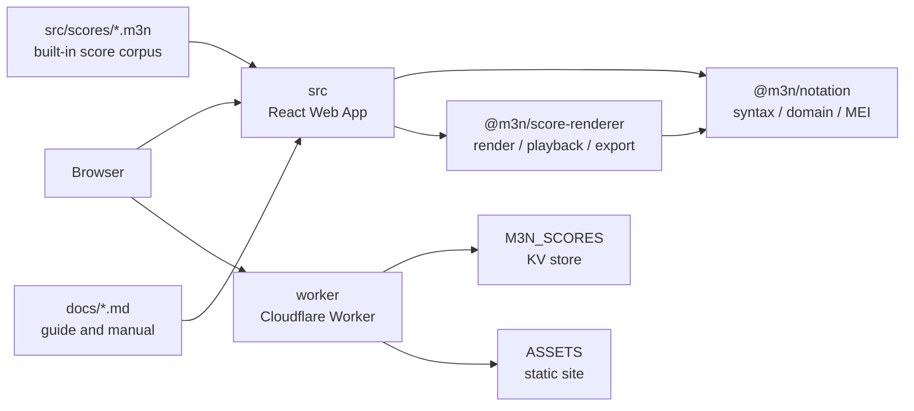
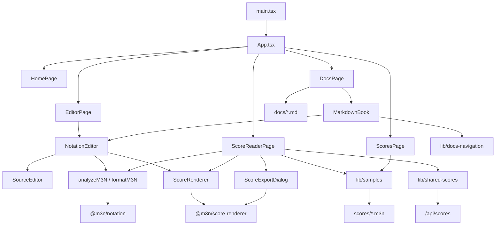
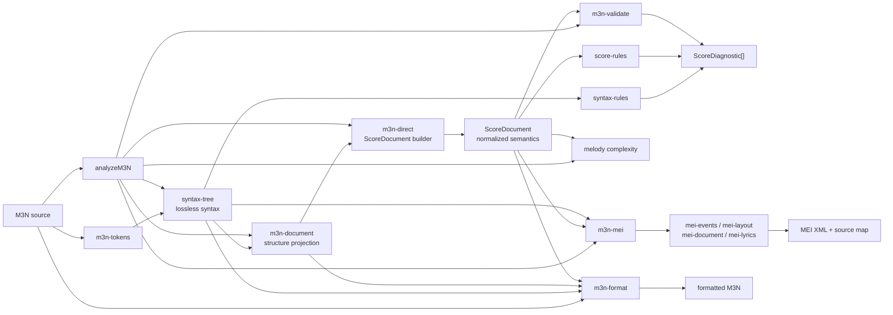
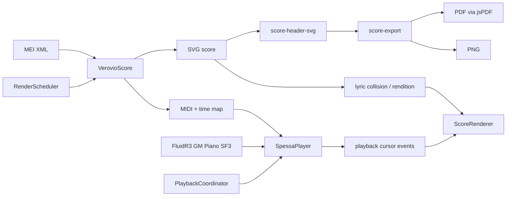
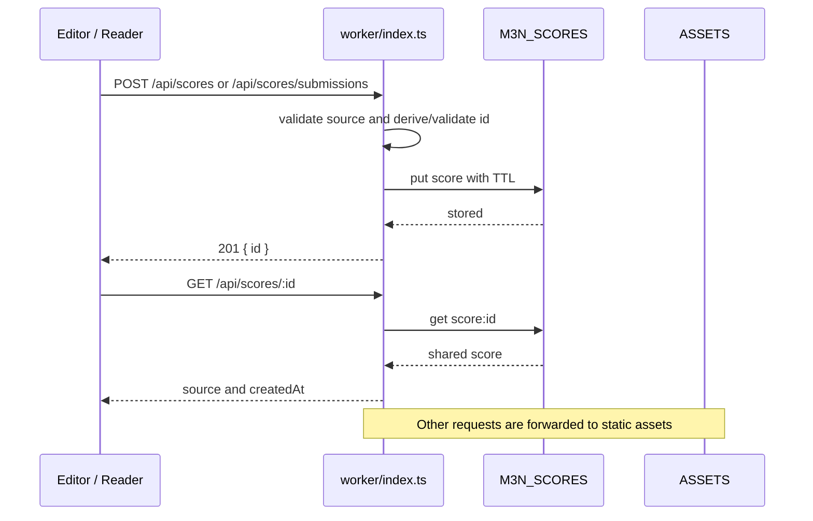

# M3N Code Graph

本文从源码入口和静态 import 关系整理仓库的主要模块、依赖方向与运行时数据流。箭头表示调用或依赖方向；测试文件和构建产物未纳入图中。

## 仓库边界

允许的包依赖方向为 `src -> @m3n/score-renderer -> @m3n/notation`，同时 `src` 可以直接调用 `@m3n/notation`。`worker` 是独立部署入口，不依赖 React 或两个业务包。

## Web 应用

页面由 `App.tsx` 懒加载。编辑器和阅读页共享分析与渲染路径；曲库元数据在构建时由 `lib/samples.ts` 从 `.m3n` 正文生成。

## Notation 领域流水线

`M3NSyntaxTree` 保留原文和源码范围，供格式化、结构规则和定位使用；`ScoreDocument` 提供规范化音乐语义，供校验、复杂度计算、播放计划和 MEI 序列化使用。交互调用方以 `analyzeM3N` 为聚合入口，复用一次解析得到的派生结果。

## 渲染、播放与导出

Verovio WASM 的排版任务由 `RenderScheduler` 串行化；`PlaybackCoordinator` 保证多个乐谱实例之间播放互斥。导出路径复用渲染 SVG，并在输出前组合标题信息。

## 分享 API

临时分享 ID 来自源码 SHA-256 的前 6 字节并保留 7 天；投稿 ID 由前端生成并经 Worker 校验，保留 15 天。

## 公共入口

| 边界 | 公共入口 | 主要消费者 |
| --- | --- | --- |
| Notation | `packages/notation/src/index.ts` | Web 应用、score-renderer、工具脚本与测试 |
| Score renderer | `packages/score-renderer/src/index.ts` | `ScoreRenderer`、`ScoreExportDialog` |
| Web app | `src/main.tsx`、`src/App.tsx` | 浏览器路由与页面 |
| Worker | `worker/index.ts` | Cloudflare Workers runtime |

更新模块边界、公共入口或关键数据流时，应同步更新本图和 [架构文档](ARCHITECTURE.md)。
